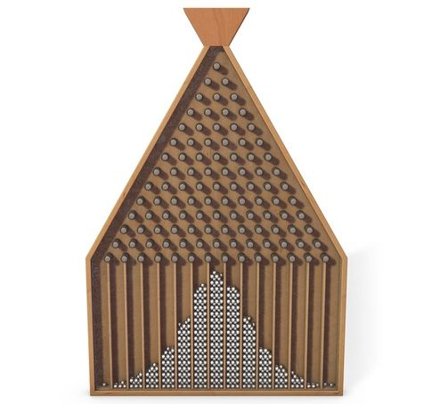

# ParDProgLabs

Набор лабораторных по дисциплине «Параллельное и распределённое программирование». Здесь будут собраны решения всех заданий из списка (взлом MD5, доска Гальтона, Docker-вариант, параллельный рюкзак, параллельный коммивояжёр).

## Задание 1 — «Взлом» MD5
- **Цель:** подобрать короткий пароль (4–5 символов) по известному MD5-хэшу методом полного перебора.
- **Реализация:** класс `org.javakov.md5.Md5BruteForcer` реализует перебор с настраиваемыми границами длины и алфавитом, а `Md5BruteForceApp` служит консольной демонстрацией.
- **Запуск:** `./gradlew run "--args=<md5-хэш>"`. Если аргумент не передан, приложение само вычисляет хэш от образцового пароля `p4rd` и подбирает его.
- **Вывод:** во время перебора отображается анимированный прогресс-бар. После завершения печатается найденный пароль, число попыток и время подбора (например, ~3.7 млн попыток и ~13 с на тестовой машине).
- **Docker:** для запуска без установки JDK используйте образ из задания 3 (см. ниже).

## Задание 2 — Доска Гальтона
- **Цель:** промоделировать классическую доску Гальтона и вывести распределение шариков псевдографикой.
- **Реализация:** пакет `org.javakov.galton` содержит чистый симулятор (`GaltonBoardSimulator`), конфигурацию (`GaltonBoardConfig`) и рендерер диаграммы (`GaltonBoardAsciiRenderer`). `GaltonBoardApp` — консольный запуск.
- **Запуск:** `./gradlew runGalton "--args=<levels> <balls>"`. Аргументы необязательны, по умолчанию используется 12 уровней и 5000 шариков.
- **Вывод:** на экран выводится текстовая столбчатая диаграмма фиксированной высоты (20 строк), ось X отображает номера слотов, а подпись показывает максимум в распределении.
- **Пример:** 
- 

## Задание 3 — Docker-обёртка для взлома MD5
- **Цель:** упаковать решение из задания 1 в контейнер, чтобы запускать подбор на любой машине без JDK.
- **Реализация:** многостадийный `Dockerfile`. Стадия сборки использует официальный `gradle:8.14-jdk21`, выполняет `gradle installDist`, а стадия рантайма основана на `eclipse-temurin:21-jre`, копирует готовый дистрибутив и запускает `Md5BruteForceApp`.
- **Сборка образа:** `docker build -t pardprog-md5 .`
- **Запуск контейнера:** `docker run --rm pardprog-md5 3e283b8c501192cb4efe596299119a49`. Можно опустить аргумент — тогда внутри будет подобран пароль `p4rd`.
- **Вывод:** полностью повторяет консольную версию, включая прогресс-бар и отчёт о количестве попыток/времени. Логи удобно смотреть прямо в Docker Desktop (см. пример скриншота).

## Задание 4 — Параллельный рюкзак
- **Цель:** решить задачу 0/1-рюкзака параллельно (branch-and-bound + ForkJoin) и получить выигрыш по времени.
- **Реализация:** пакет `org.javakov.knapsack`. Класс `ParallelKnapsackSolver` использует ForkJoinPool и верхнюю оценку (fractional bound) для отсечения веток. `KnapsackApp` — CLI, читающий данные из файла (`src/main/resources/knapsack/sample.txt` по умолчанию).
- **Запуск:** `./gradlew runKnapsack "--args=--dataset src/main/resources/knapsack/sample.txt --threads 8"`. Можно опустить аргументы: тогда берётся встроенный пример и число потоков = количеству ядер.
- **Формат входа:** первая строка — вместимость, далее `вес ценность [название]`. Строки с `#` игнорируются.
- **Вывод:** список выбранных предметов, итоговая ценность, число исследованных узлов и время выполнения.

## Задание 5 — Параллельный коммивояжёр
- **Цель:** найти короткий маршрут по случайно сгенерированным городам, используя параллельный поиск и локальные улучшения.
- **Реализация:** `ParallelTspSolver` запускает несколько потоков; каждый генерирует случайные туры и применяет 2-opt оптимизацию, делясь лучшим результатом через атомарную ссылку. `TspRenderer` строит PNG с маршрутом.
- **Запуск:** `./gradlew runTsp "--args=--cities 30 --threads 8 --output route.png"`. Дополнительные параметры: `--iterations`, `--attempts`, `--seed`, размеры области (`--width`, `--height`).
- **Вывод:** консоль показывает длину найденного тура, координаты городов и время; при указании `--output` сохраняется изображение маршрута в `route.png`.

## Задание 6 — Магические квадраты
- **Цель:** построить магические квадраты 3×3 и 4×4 двумя методами: полный перебор и Монте-Карло.
- **Реализация:** пакет `org.javakov.magic` содержит модель квадрата, backtracking‑генератор (`MagicSquareBruteForce`) и стохастический `MagicSquareMonteCarlo`.
- **Запуск:** `./gradlew runMagic "--args=--size 3 --method brute_force"` или `./gradlew runMagic --args "--size 4 --method monte_carlo --attempts 200000"`.
- **Вывод:** количество найденных квадратов, несколько примеров и время выполнения. Монте-Карло сообщает, удалось ли найти квадрат в заданное число попыток.

## Задание 7 — «Собратья» произведения
- **Цель:** найти все комбинации множителей и результата, у которых мультимножество цифр совпадает с уравнением `48 * 159 = 7632`.
- **Реализация:** пакет `org.javakov.brothers`. Класс `BrothersFinder` перебирает кандидатов и сравнивает мультимножества цифр.
- **Запуск:** `./gradlew runBrothers` (по умолчанию ищет собратьев для 48×159), можно передать свои числа: `./gradlew runBrothers --args "abc def xyz"`.
- **Вывод:** количество найденных собратьев и первые совпадения в формате `a * b = c`.
